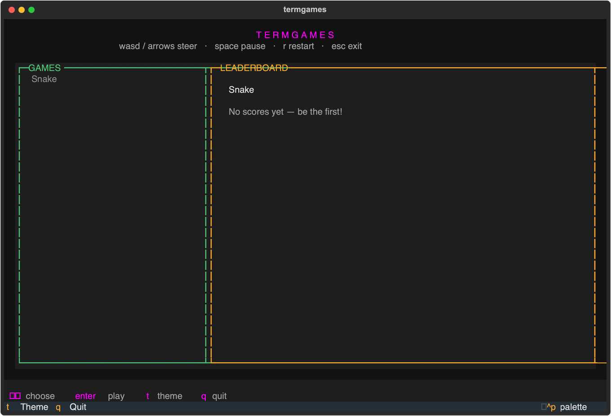

# termgames



A small collection of terminal games built with [Textual](https://github.com/Textualize/textual),
all sharing one control scheme so switching games never means relearning
the keys:

| Key            | Action                          |
|----------------|----------------------------------|
| `w a s d` / arrows | steer / move                |
| `space`        | pause / resume                  |
| `r`            | restart (while paused or over)  |
| `esc`          | exit to the menu                |

## Games

- **Snake** — the original [ViperSSH](https://github.com/SInsanali/viperssh) easter egg, now a real menu entry. wasd/arrows steer.

More games are coming back to the menu later — the rest of the original
lineup (Tetris, 2048, Breakout, Pong, Tron) is still in git history and
easy to restore.

Your personal best persists to `~/.termgames/scores/`. Separately, each
game keeps a **top-3 leaderboard** of named scores: land in the top 3 and
you'll be prompted to enter a name (`enter` to save, `esc` to skip), and
it shows up in the launcher's right-hand panel.

Launching `termgames` opens a two-pane menu: pick a game on the left, and
the right panel shows that game's leaderboard. Press `t` to open the theme
picker — the same 13 named color themes as ViperSSH (Viper, Cyberpunk,
Sunset, Matrix, Blaze, Dracula, One Dark, Monokai, Ember, Gruvbox, Aurora,
Midnight, Jade), applied across the menu and every game. Your choice is
remembered in `~/.termgames/theme` for next time. `enter` plays the
highlighted game, `esc` returns to the menu.

## Install & run

One command, no manual setup:

```bash
git clone https://github.com/SInsanali/termgames.git
cd termgames
./termgames
```

The `termgames` script creates its own virtual environment under `venv/`,
installs dependencies into it, and launches the app — self-healing on every
run, so there's nothing to maintain by hand. The first run also offers to
symlink itself onto your `PATH` (as `termgames` or `tg`) so you can launch
it from anywhere afterward; re-run `./termgames --setup` to redo that later.

## Adding a game

Every game is a `BaseGameScreen` subclass (see `src/termgames/common/engine.py`)
that implements three methods:

- `reset()` — set up a fresh board/score
- `tick()` — advance one step of the game clock
- `build_frame(theme)` — return the board's rows as Rich-markup strings

The base class handles input bindings, the pause/game-over state machine,
themed borders, high-score persistence, and the top-3 leaderboard prompt,
so a new game is just its grid logic. Drop the new package under
`src/termgames/`, add it to `GAMES` in `src/termgames/main.py` — it shows
up in the launcher menu and its leaderboard panel.
